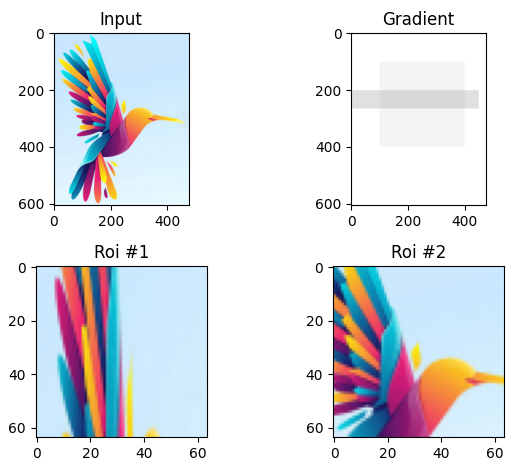

RoiAlign 3D kernels for Tensorflow
==================================

This repository contains the code needed to implement efficient hard attention for two stage detectors and other tasks.

The original 2D code is pulled from torchvision and transformed to 3D and tailored to Tensorflow.

It also contains a pure tensorflow implementation of the op (only 2D yet), although it is roughly 15 times slower compared to the CUDA kernels.

The following functionalities are implemented:
* RoiAlign 2D + gradient, CPU
* RoiAlign 2D + gradient, CUDA
* RoiAlign 2D pure tensorflow (slow)
* RoiAlign 3D + gradient, CPU (single thread only yet)
* RoiAlign 3D + gradient, CUDA

Building
--------

There are two options for building the kernels:
* With CUDA toolkit and gcc: CPU + CUDA: `mkdir build && build all `
* With GCC only: `mkdir build && build no_cuda`

Tested with Tensorflow version `2.14.0` and cuda toolkit `11.8`.

Usage
-----

* Set the paths: `export ROI_ALIGN_LIB=build/libroi_align_cpu_cuda.so`
* `test.py`:
```python3
from pysrc import roi_align_tf as rtf
roi_align = rtf.RoiAlign()

# image can be 
#    (N, H, W, C) in 2D or
#    (N, D, H, W, C) in 3D
# See pysrc/roi_align_tf_test.py for examples.
rois = roi_align(image, boxes, [64, 64])
```



The interface should be similar to the torchivision's: https://pytorch.org/vision/main/generated/torchvision.ops.roi_align.html

One can switch between the pure Tensorflow and binary implementation using the constructor argument `fast_impl`.